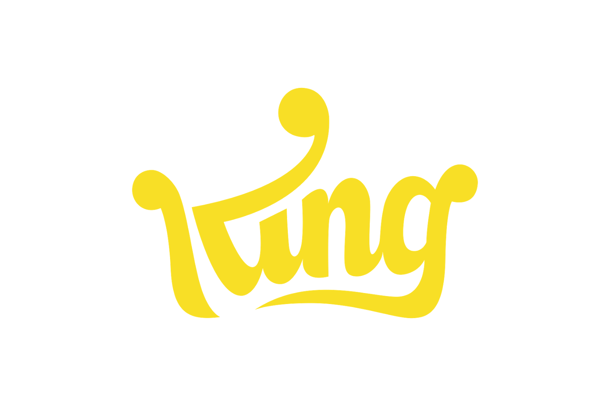

<br/>
<p align="center">
  <a href="https://github.com/MuhammedFayazTS/Chat-Web-App">
    
  </a>

  <h3 align="center">Candy Crush Game Clone</h3>

  <p align="center">
    Candy Crush base game clone developed using React JS.
    <br/>
    <br/>
    <a href="https://github.com/MuhammedFayazTS/Candy-Crush.git"><strong>Explore the docs »</strong></a>
    <br/>
    <br/>
    <a href="https://candy-crush-by-fayaz.netlify.app/">View Demo</a>
    .
    <a href="https://github.com/MuhammedFayazTS/Candy-Crush/issues">Report Bug</a>
    .
    <a href="https://github.com/MuhammedFayazTS/Candy-Crush/issues">Request Feature</a>
  </p>
</p>

   

## About The Project

<div style="display: flex; justify-content: space-around; align-items: center;">
  
  
</div>

# Candy Crush Clone

This is a simple Candy Crush base game clone built with React JS, Tailwind CSS, and vanilla JavaScript for game logic.

## Tech Stack

- **Frontend**: React JS - for building the user interface and managing component interactions.
- **Styling**: Tailwind CSS - for applying styles quickly and responsively.
- **Game Logic**: JavaScript - for implementing core gameplay mechanics.

## Components

- **Board**: Renders the game board with a grid of squares containing candy sprites.
- **Candy**: Individual candy component with properties like color and type.
- **Swap**: Handles user interaction for swapping adjacent candies by drag and drop.
- **Match Detection**: Detects horizontal and vertical lines of matching candies.
- **Scoring**: Tracks points earned based on matches and special candy effects.
- **Animations**: Handles animations for candy swapping, clearing lines, and cascading candies.
- **Sound Effects**: Adds auditory feedback for game events such as matching candies or clearing lines.

## Game Logic

- **Swapping**: Users can swap adjacent candies.
- **Matching**: Lines (horizontal or vertical) of three or more candies of the same color are cleared.
- **Cascading**: Cleared candies disappear, and candies above fall down, potentially creating new matches.
- **Scoring**: Points awarded based on the number of candies cleared.

## Tailwind CSS Benefits

- **Rapid Prototyping**: Quickly style UI elements with pre-built classes.
- **Responsiveness**: Built-in responsive utilities for different screen sizes.
- **Customization**: Ability to tailor styles to your specific needs.

## Running the Project

To get started with the Candy Crush clone, follow these steps:

1. Clone the repository:

    ```bash
    git clone https://github.com/MuhammedFayazTS/Candy-Crush.git
    ```

2. Navigate into the project directory:

    ```bash
    cd Candy-Crush
    ```

3. Install dependencies using npm:

    ```bash
    npm install
    ```

4. Start the development server:

    ```bash
    npm start
    ```

This will launch the Candy Crush clone in your default web browser. Have fun playing!
